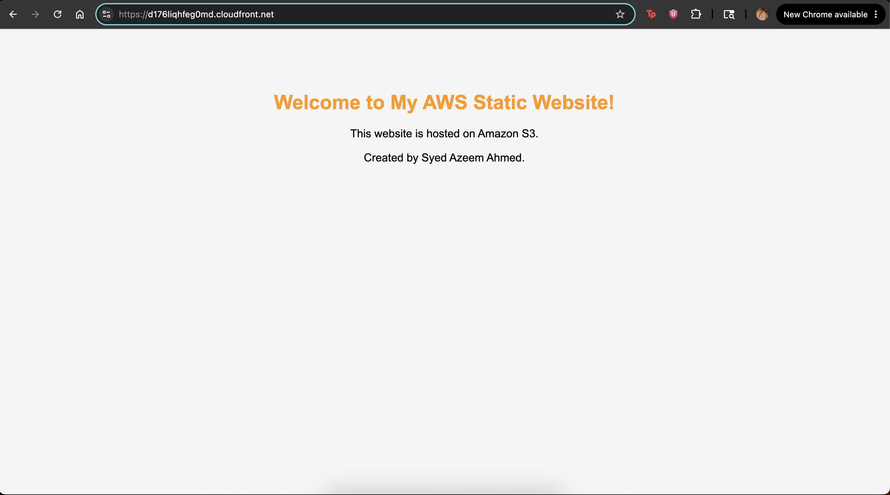
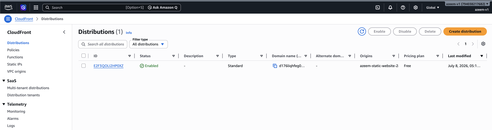

# AWS Static Website Hosting with Amazon S3 & CloudFront

## Overview
This project demonstrates how to host a static website using Amazon S3 and securely deliver it over HTTPS using Amazon CloudFront.
The website consists of a simple HTML and CSS frontend deployed to an S3 bucket configured for Static Website Hosting. CloudFront is used as a Content Delivery Network (CDN) to improve performance and provide HTTPS access.

---

## Screenshots

### Live Website



### CloudFront Distribution



---

## AWS Services Used

- Amazon S3
- Amazon CloudFront
- AWS IAM
- S3 Bucket Policy

---

## Features

- Static website hosted on Amazon S3
- Public access configured using Bucket Policies
- HTTPS delivery using Amazon CloudFront
- Simple HTML and CSS website
- Global content delivery through AWS edge locations

---

## Project Structure

```
aws-static-website-hosting/
│
├── website/
│   ├── index.html
│   └── style.css
│
├── screenshots/
│
└── README.md
```

---

## Deployment Steps

1. Create an S3 bucket.
2. Enable Static Website Hosting.
3. Upload website files.
4. Configure Bucket Policy for public access.
5. Create a CloudFront distribution.
6. Configure the default root object as index.html.
7. Access the website securely over HTTPS.

---

## Skills Demonstrated

- AWS S3
- CloudFront
- Static Website Hosting
- Bucket Policies
- CDN
- HTTPS
- HTML
- CSS

---

## Author

**Syed Azeem Ahmed**

AWS Certified Solutions Architect – Associate (Score: 889)
